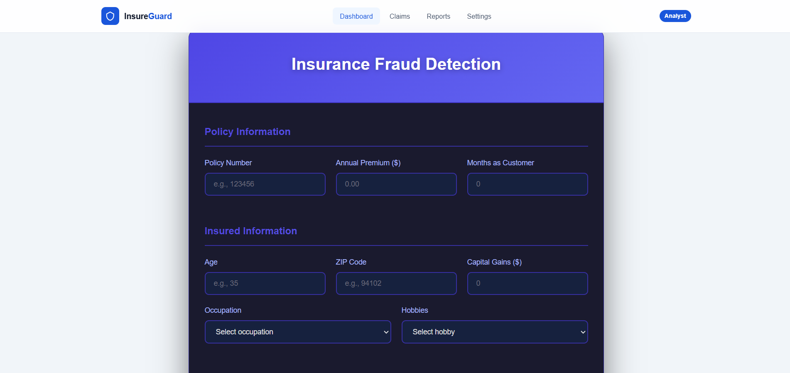
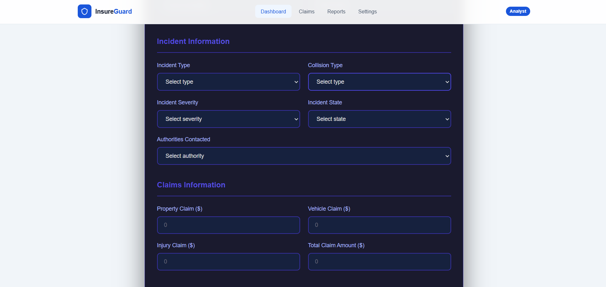
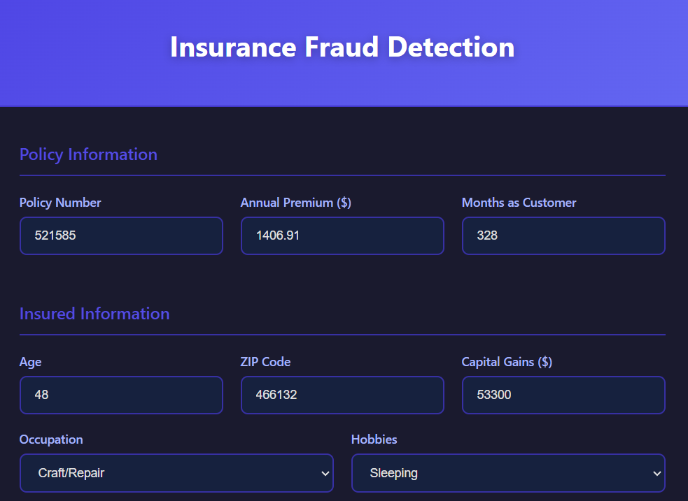
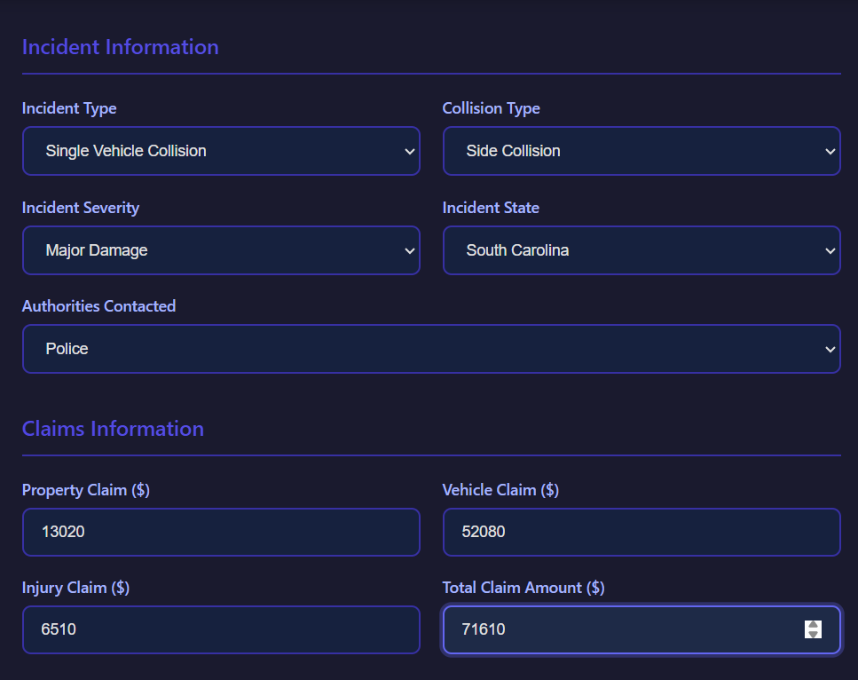

# End-to-End ML Project - Insurance Prediction

# 📌 Problem Statement

Insurance companies lose billions of dollars every year due to fake insurance claims. When people lie about accidents to get money, it forces insurance prices (premiums) to go up for everyone else.

# The Goal
The goal of this project is to build an intelligent system that can automatically flag whether an insurance claim is Genuine or Fraudulent.


<br>

<br>

<br>
<br>

<br>

<br>


# Project Objective

The objective of this project is to build a Production-Ready End-to-End Machine Learning Pipeline that:

- Analyzes Categorical Relationships: Uses statistical tests (Chi-Square) to identify which factors (like incident severity or customer hobbies) actually correlate with fraud.

- Automates Detection: Implements a high-performance Gradient Boosting model (LightGBM) to classify claims as Fraud or Non-Fraud.


- Recoverable (96.2%): These are the 2,707 orders that were actual losses and correctly flagged by our model. By applying our suggestion system here, we are essentially "plugging" the leaks in the company's profit.

- Missed (3.8%): These are the 106 orders where the model predicted profit, but they ended up being losses. This represents the tiny margin of error where the company still loses money.


1.LightGBM (0.815 Accuracy) LightGBM is clearly our best performer. It didn't just guess; it learned the patterns effectively.

  - F1-Score (0.64): The highest in our list, meaning it has the best balance.

  - Recall (0.60): It caught 60% of all fraud cases. While not 100%, it is significantly better than the basic models.

  - Precision (0.68): When it says "Fraud," it is correct 68% of the time. This means fewer innocent customers are harassed.

2.Gradient Boosting (0.800 Accuracy)

  - Recall (0.54): It catches about half of the frauds.

  - Precision (0.66): It is fairly reliable but slightly less accurate than LightGBM.

  - The Aggressive Model: Decision Tree (0.780 Accuracy)

  - Recall (0.56): It has a decent catch rate, but its Precision (0.60) is lower. This means it might flag more honest customers as suspicious compared to LightGBM.

The Worst Models: Logistic Regression & Random Forest Even after SMOTE, these models struggled:

Random Forest Recall (0.20): This is very poor for fraud detection. It missed 80% of the fraudsters!


##  What I Built

- A Machine Learning model that analyzes insurance claim history to predict whether a claim is fraudulent or genuine with 82% accuracy.

- A production-grade ML pipeline that automates the entire lifecycle, including data ingestion, Data validation , transformation, and model training.

- A configuration-driven architecture where all hyperparameters and data schemas are managed through YAML files, allowing for seamless model tuning without changing the source code.

- A modular enterprise-ready structure featuring custom logging, exception handling, and entity-based data mapping to ensure code reliability and easy debugging.

- A cloud-ready deployment setup integrated with AWS storage, MongoDB, and Docker, enabling the project to be scaled and deployed in a containerized environment.

# Project Structure

```
📁 Insurance Prediction
├── 📁 config/                      # YAML files for model params & schema
│   ├── model.yaml
│   └── schema.yaml
├── 📁 notebook/                    # Notebooks
│   ├── 1_EDA.ipynb                 # Exploratory Data Analysis - Insurance Claim Prediction
│   ├── 2_feature_selection.ipynb   # Feature Selection 
│   ├── 3_preprocess.ipynb          # Data Preprocessing 
│   ├── 4_Model_Training (1).ipynb  # Model Training & Hyperparameter Tuning
│   ├── insurance_claims.csv        # Raw dataset
│   ├── insurance_claim_data.csv    # Cleaned/Processed dataset
│   └── mongoDB_demo.ipynb          # Database connection testing & Data Fetching Test
├── 📁 src/              # Core source code (The Package)
│   ├── __init__.py
│   ├── 📁 cloud_storage/           # S3 cloud handlers
│   │   ├── __init__.py
│   │   └── aws_storage.py
│   ├── 📁 components/              # Step-by-step modular pipeline blocks
│   │   ├── __init__.py
│   │   ├── data_ingestion.py       # Pulling data from MongoDB/CSV
│   │   ├── data_validation.py      # Checking data against schema.yaml
│   │   ├── data_transformation.py  # Cleaning & Feature Engineering
│   │   ├── model_trainer.py        # LightGBM training with config
│   │   ├── model_evaluation.py     # AUC/F1-score analysis
│   │   └── model_pusher.py         # Pushing model to S3/Model Registry
│   ├── 📁 configuration/           # Database & AWS connection logic
│   ├── 📁 constants/               # Fixed variables (file paths, db names)
│   ├── 📁 data_access/             # DAO for DB queries
│   ├── 📁 entity/                  # Dataclasses for inputs/outputs
│   │   ├── config_entity.py
│   │   └── artifact_entity.py
│   ├── 📁 exception/               # Custom error handling
│   ├── 📁 logger/                  # Logging info/errors to files
│   ├── 📁 pipline/                 # Training and prediction orchestration
│   │   ├── training_pipeline.py
│   │   └── prediction_pipeline.py
│   └── 📁 utils/                   # Reusable functions 
├── 📁 static/                      # CSS file for ui design
│   └── 📁 css/
│       └── style.css
├── 📁 templates/                   # HTML files for Flask
│   └── index.html
├── app.py                          # Main Flask application
├── demo.py                         # Local testing script
├── Dockerfile                      # Containerization instructions
├── .dockerignore                   # Files to skip in Docker
├── pyproject.toml                  # Modern Python build config
├── requirements.txt                # List of libraries
└── setup.py                        # Makes the project installable

```


## 📁 Project Setup and Structure

### Step 1: Project Template
- Start by executing the `template.py` file to create the initial project template, which includes the required folder structure and placeholder files.

### Step 2: Package Management
- Write the setup for importing local packages in `setup.py` and `pyproject.toml` files.


### Step 3: Virtual Environment and Dependencies
- Create a virtual environment and install required dependencies from `requirements.txt`:
  ```bash

  python -m venv myenv_insurance
  myenv_insurance/Scripts/activate
  pip install -r requirements.txt

  ```
- Verify the local packages by running:
  ```bash
  pip list
  ```

---

## 📊 MongoDB Setup and Data Management

### Step 4: MongoDB Atlas Configuration
1. Sign up for [MongoDB Atlas](https://www.mongodb.com/cloud/atlas) and create a new project.
2. Set up a free M0 cluster, configure the username and password, and allow access from any IP address (`0.0.0.0/0`).
3. Retrieve the MongoDB connection string for Python and save it (replace `<password>` with your password).

### Step 5: Pushing Data to MongoDB
1. Create a folder named `notebook`, add the dataset, and create a notebook file `mongoDB_demo.ipynb`.
2. Use the notebook to push data to the MongoDB database.
3. Verify the data in MongoDB Atlas under Database > Browse Collections.

---

## 📝 Logging, Exception Handling, and EDA

### Step 6: Set Up Logging and Exception Handling
- Create logging and exception handling modules. Test them on a demo file `demo.py`.

### Step 7: Exploratory Data Analysis (EDA) and Feature Engineering
- Analyze and engineer features in the `EDA` and `Feature Engg` notebook for further processing in the pipeline.

---

## 📥 Data Ingestion

### Step 8: Data Ingestion Pipeline
- Define MongoDB connection functions in `configuration.mongo_db_connections.py`.
- Develop data ingestion components in the `data_access` and `components.data_ingestion.py` files to fetch and transform data.
- Update `entity/config_entity.py` and `entity/artifact_entity.py` with relevant ingestion configurations.
- Run `demo.py` after setting up MongoDB connection as an environment variable.

### Setting Environment Variables
- Set MongoDB URL:
  ```bash
  # For Bash
  export MONGODB_URL="mongodb+srv://<username>:<password>...."
  # For Powershell
  $env:MONGODB_URL = "mongodb+srv://<username>:<password>...."
  ```

---

## 🔍 Data Validation, Transformation & Model Training

### Step 9: Data Validation
- Define schema in `config.schema.yaml` and implement data validation functions in `utils.main_utils.py`.

### Step 10: Data Transformation
- Implement data transformation logic in `components.data_transformation.py` and create `estimator.py` in the `entity` folder.

### Step 11: Model Training
- Define and implement model training steps in `components.model_trainer.py` using code from `estimator.py`.

---

## 🌐 AWS Setup for Model Evaluation & Deployment

### Step 12: AWS Setup
1. Log in to the AWS console, create an IAM user, and grant `AdministratorAccess`.
2. Set AWS credentials as environment variables.
   ```bash
   # For Bash
   export AWS_ACCESS_KEY_ID="YOUR_AWS_ACCESS_KEY_ID"
   export AWS_SECRET_ACCESS_KEY="YOUR_AWS_SECRET_ACCESS_KEY"
   ```

3. Configure S3 Bucket and add access keys in `constants.__init__.py`.

### Step 13: Model Evaluation and Pushing to S3
- Create an S3 bucket named `my-model-project` in the `us-east-1` region.
- Develop code to push/pull models to/from the S3 bucket in `src.aws_storage` and `entity/s3_estimator.py`.

---

## 🚀 Model Evaluation, Model Pusher, and Prediction Pipeline

### Step 14: Model Evaluation & Model Pusher
- Implement model evaluation and deployment components.
- Create `Prediction Pipeline` and set up `app.py` for API integration.

### Step 15: Static and Template Directory
- Add `static` and `template` directories for web UI.

---

## 🔄 CI/CD Setup with Docker, GitHub Actions, and AWS

### Step 16: Docker and GitHub Actions
1. Create `Dockerfile` and `.dockerignore`.
2. Set up GitHub Actions with AWS authentication by creating secrets in GitHub for:
   - `AWS_ACCESS_KEY_ID`
   - `AWS_SECRET_ACCESS_KEY`
   - `AWS_DEFAULT_REGION`
   - `ECR_REPO`

### Step 17: AWS EC2 and ECR
1. Set up an EC2 instance for deployment.
2. Install Docker on the EC2 machine.
3. Connect EC2 as a self-hosted runner on GitHub.

### Step 18: Final Steps
1. Open the 5000 port on the EC2 instance.
2. Access the deployed app by visiting `http://<public_ip>:5000`.

---
##  Technologies Used

- Machine Learning: Scikit-learn, Pandas, NumPy , Matplotlib , Seaborn , Plotly

- API: FastAPI

- Cloud: AWS (S3, ECR, EC2)

- UI: HTML , CSS

- CI/CD: GitHub Actions

- Containerization: Docker


## 🎯 Project Workflow Summary

1. **Data Ingestion** ➔ **Data Validation** ➔ **Data Transformation**
2. **Model Training** ➔ **Model Evaluation** ➔ **Model Deployment**
3. **CI/CD Automation** with GitHub Actions, Docker, AWS EC2 and ECR


